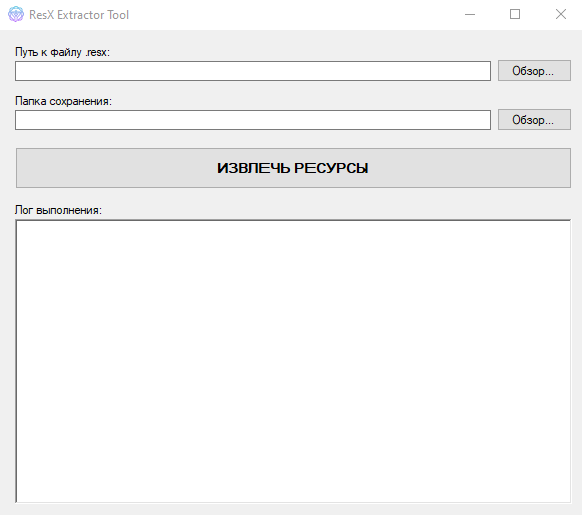

# 📦 ResX Extractor Tool


**ResX Extractor Tool** — это удобная утилита с графическим интерфейсом (Windows Forms) для быстрого и безопасного извлечения любых вложенных ресурсов из файлов `.resx`. 

Программа идеально подходит для разработчиков, которым нужно "достать" картинки, иконки, тексты или звуки из старых проектов, если оригинальные исходники файлов были утеряны.

---

## ✨ Возможности

Программа автоматически распознает типы данных внутри `.resx` и извлекает их в соответствующих форматах:

*   🖼️ **Изображения (`Image`)** — конвертируются и сохраняются в формате `.png`.
*   💠 **Иконки (`Icon`)** — сохраняются в оригинальном формате `.ico`.
*   🎵 **Аудио и потоки (`Stream`)** — экспортируются в формате `.wav`.
*   📝 **Текстовые данные (`String`)** — собираются в единый удобный файл `_AllStrings.txt`.
*   📦 **Бинарные данные (`byte[]`)** — сохраняются как `.bin` файлы.
*   🛡️ **Безопасность файлов** — автоматическая очистка имен файлов от недопустимых символов.
*   🚦 **Умная распаковка** — защита от случайной перезаписи (программа предупредит, если целевая папка не пуста).

---

## 🚀 Как использовать

> 
>  

1. Запустите программу.
2. В поле **"Путь к файлу .resx"** нажмите **Обзор...** и выберите нужный файл.
3. Программа автоматически предложит папку для сохранения (рядом с исходным файлом). При необходимости измените её.
4. Нажмите огромную кнопку **ИЗВЛЕЧЬ РЕСУРСЫ**.
5. Наблюдайте за процессом в красивом цветном логе.
6. По завершении программа автоматически откроет папку с извлеченными файлами в Проводнике! 🎉

---

## 🛠️ Сборка проекта

Проект написан на C# с использованием Windows Forms (.NET).

1. Склонируйте репозиторий:
   ```bash
   git clone https://github.com/img507/Resource-extractor.git

2. Откройте решение Resource extractor.sln в Visual Studio.
3. Скомпилируйте проект в конфигурации Release для максимальной производительности.